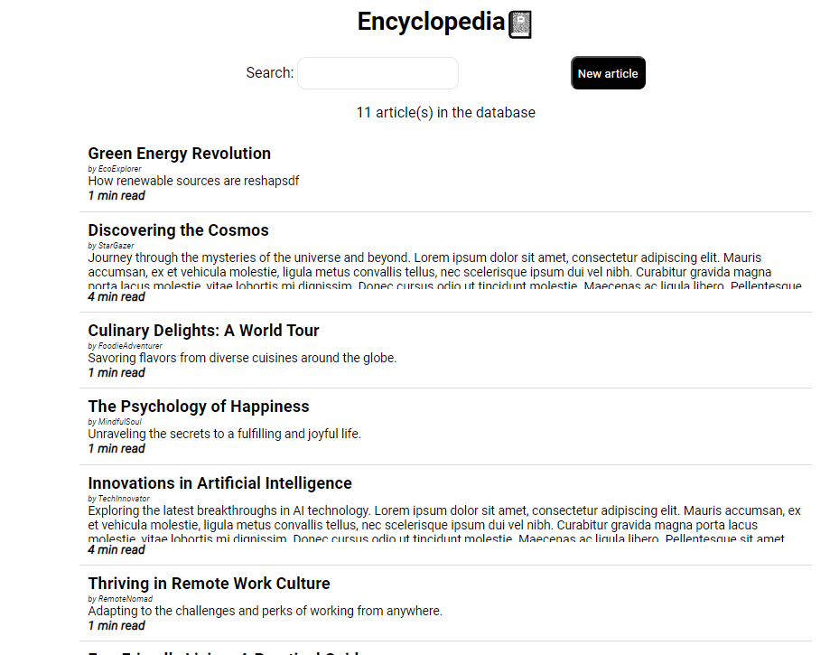
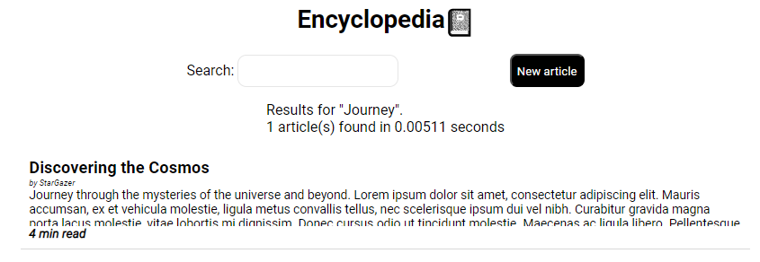
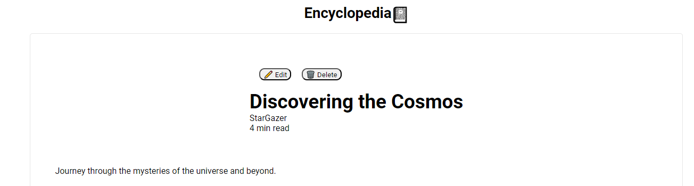
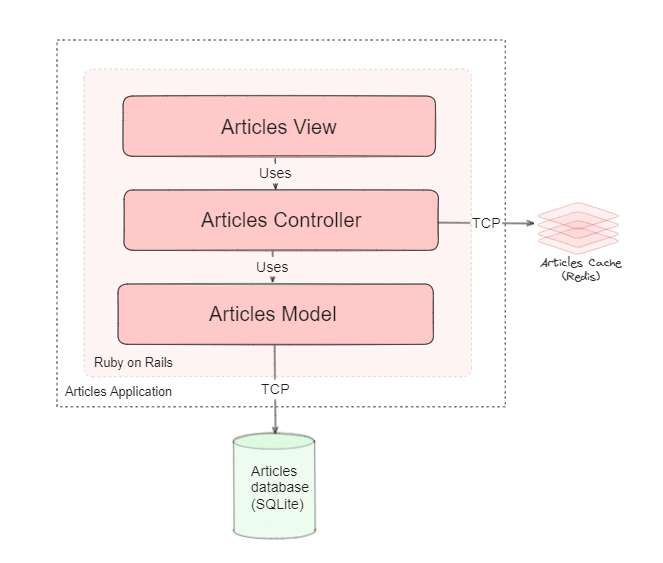

# Encyclopedia 📓

Scalable Ruby on Rails application that allows users to create, view, edit, and delete articles.

Developed for Shopify's 2024 Backend Developer Intern Challenge.

## Getting Started with Encyclopedia
### Requirements:
- Ruby 2.7.6
- Docker

### With docker-compose
1. Clone the repository to your local development environment.
2. Run the docker-compose file
```
docker-compose up -d
```
3. Site is live on localhost:3000

### Without docker-compose
1. Clone the repository to your local development environment.
2. Install the necessary dependencies
```
bundle install
```
3. Run the application
```
bin/rails server
```
4. Start the Redis server
```
docker run -d --name redis-stack-server -p 6379:6379 redis redis-stack-server:latest
```
5. Site is live on localhost:3000

### Running Tests
1. Run the tests
```
bin/rails test
```

## Core Application Features
### Home page
Contains list of articles, and search bar to search for articles.

### Search
Searches for articles based on title, and content.


### Article Viewing
View articles, with the ability to edit and delete.



## Optimizations

Search, and article viewing are optimized using caching. This allows for faster retrieval of articles, and search results.

Consider the following example:

#### Initial Cache Miss


#### Subsequent Cache Hits


#### ~77% reduction in response time

## Overview of Application Architecture
