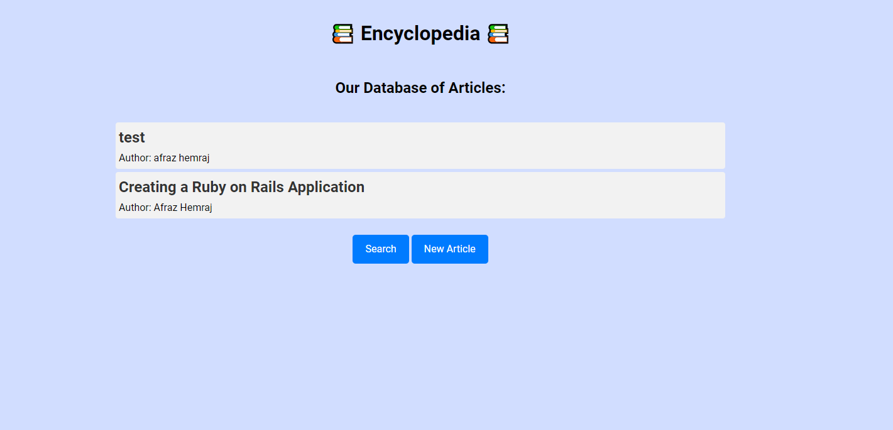
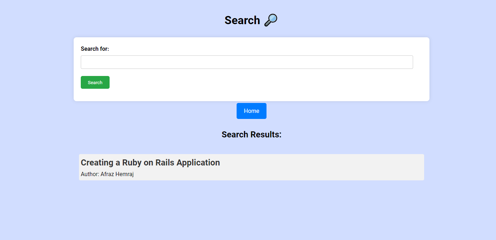
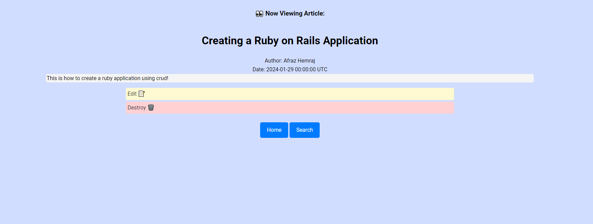
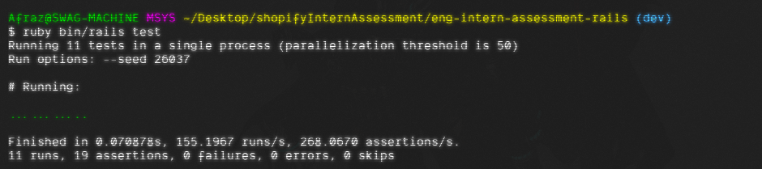

# Shopify Intern Challege: Encyclopedia 📚

Ruby on Rails application with CRUD capabilities for encyclopedia articles!

Created by Afraz Hemraj for the Shopify 2024 Backend Intern Challenge.

## Starting the App
### What you need installed:
- Ruby
- SQLite3

### Running the application (windows)
1. Clone this repository locally
2. Install dependencies
```
bundle install
```
3. In the application directory in a terminal, run:
```
ruby bin/rails server
```

1. View the application at localhost:3000

### Testing
1. Run the tests in the project directory with the following command
```
ruby bin/rails test
```

## Images from the app
### Landing Page

### Search Page


### Single Article View


### Edit/ New Article Page


### Test Case Output

