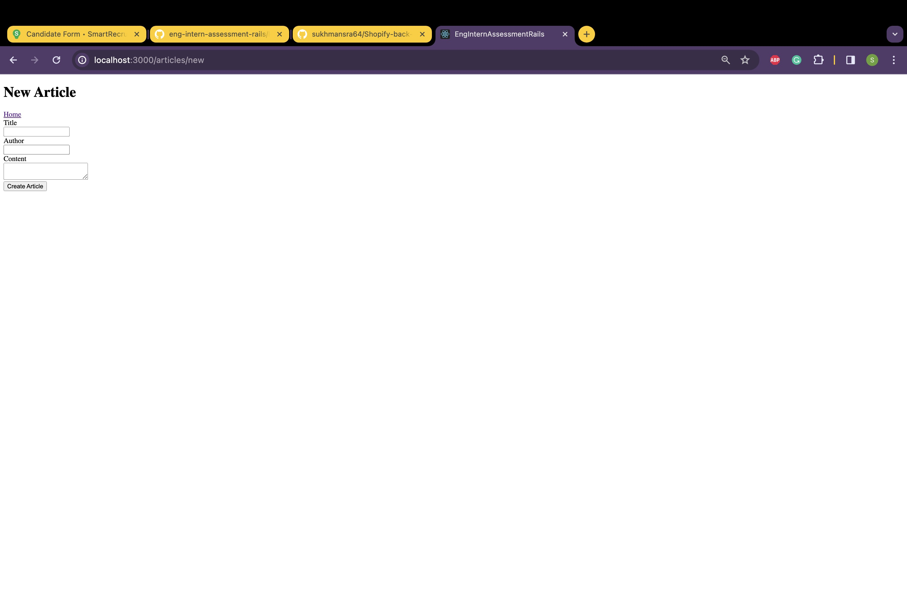
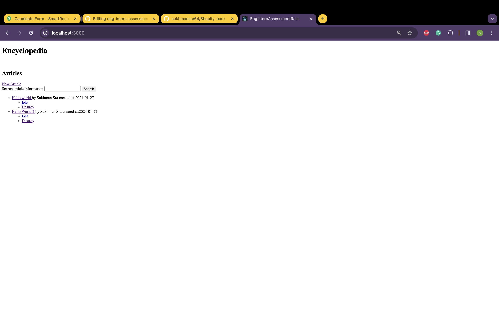
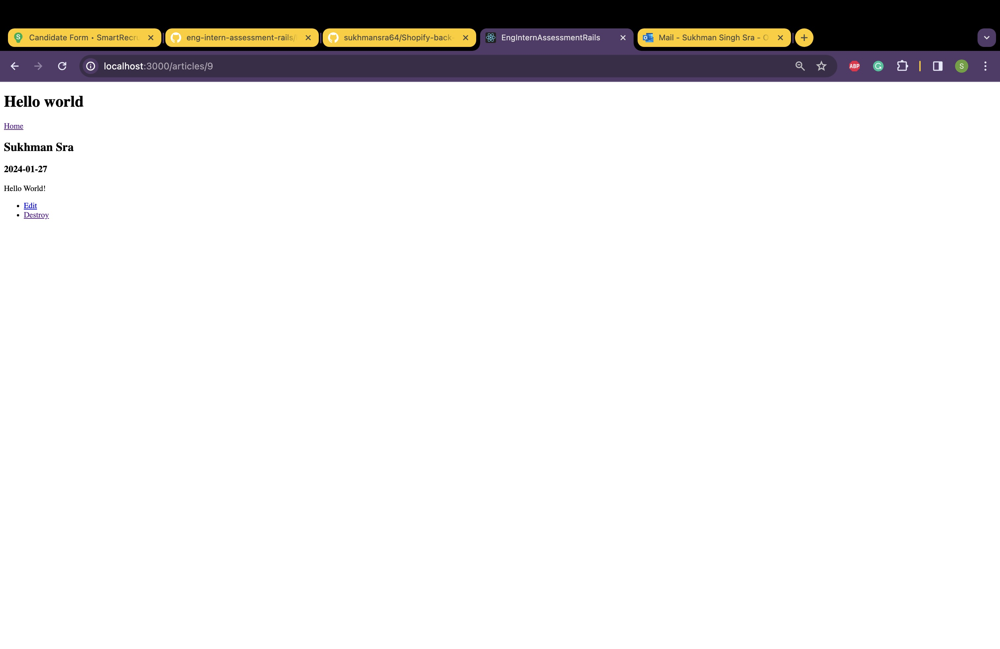
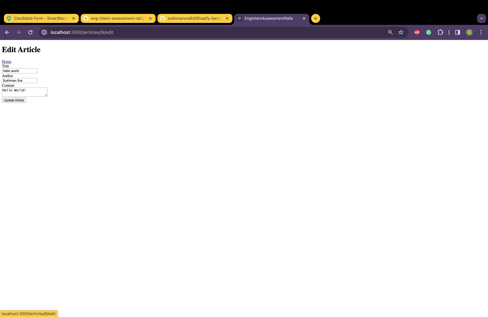

# Shopify Backend Engineering Technical Challenge
My submission to the Shopify Backend Engineering Technical Challenge. The challenge can be found here: `https://github.com/Shopify/eng-intern-assessment-rails`.

## Topics
1. Initialize Project
2. How to use CRUD functionality
3. How to test

## Initialize Project
1. Ensure that the ruby version matches the project version (2.7.6) and verify with `ruby -v`
2. Head into the project directory and install all of the project gems using `bundle install`
3. Migrate the database by using `bin/rails db:migrate`
4. Start the server using `bin/rails server`
5. Navigate to `http://localhost:3000/` in the browser of your choosing

## How to use CRUD functionality

### Create routes

#### Description: New article
#### route: `GET /articles/new`

The implemented functionality here allows you to create an article. The model requires you to have a title and content. This route uses another route in the controller to create the entry in the database by calling the `POST /articles/new`.

#### Description: Create a new article
#### route: `POST /articles/new`
Route in the controller which creates the entry into the database. Called in the previous route/view.

### Read routes

#### Description: Get all articles
#### route: `GET /`

The implemented functionality here allows you to explore each entry into the database along with searching and filtering using the search bar near the top. You can click the title to get more info on the article, along with editing or deleting the entry.

#### Description: Get an article by id
#### route: `GET /articles/:id`

The implemented functionality here allows you to explore the entry of the id you've supplied in the URL. You can also edit or delete the entry here if you like.

### Update routes

#### Description: Edit an article
#### route: `GET /articles/:id/edit`

The implemented functionality here allows you to update an article. This route uses another route in the controller to create the entry in the database by calling the `PUT /articles/:id`.

#### Description: Update an article
#### route: `PUT /articles/:id`
Route in the controller which updates the entry in the database. Called in the previous route/view.

### Delete route

#### Description: Delete an article
#### route: `DELETE /articles/:id`
Route in the controller which deletes the entry in the database. Called in the index/get all view.

## How to Test
After setting up the project, the tests can be run by running the `bin/rails test test/models/article_test.rb`.

