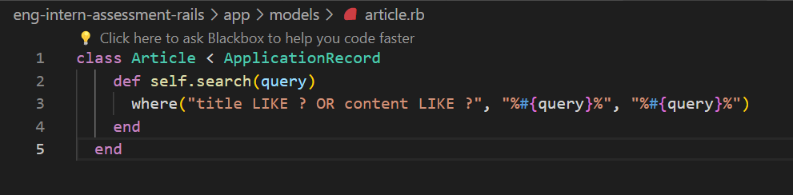
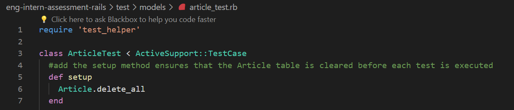

## Completed Tasks:
1. **Ran Rails Commands to Generate Controller and Scaffold:**
   - Executed `rails g controller article` to generate the ArticlesController.
   - Ran `rails generate scaffold Article title:string content:text author:string date:date` to create a scaffold for the Article model, generating controller, views, and migrations.

2. **Added Database Migrations and Updated Schema:**
   - Created database migrations to define the schema for articles.
   - Updated the schema to accommodate the required fields for articles.

3. **Implemented the Article Model:**
   - Developed the Article model with necessary validations and associations.

4. **Added Articles Controller and Views for CRUD Operations:**
   - Implemented the articles controller to handle CRUD operations.
   - Created corresponding views for creating, viewing, editing, and deleting articles.

5. **Implemented Search Functionality:**
   - Implemented the `search` method in the Article model to enable search functionality.
   - Ensured that the existing tests related to article search pass.
   

6. **Resolved Test Failures:**
   - Addressed issues in tests:
     - `test_starts_with_no_articles`: Fixed by creating a clean database method before each test.
     - `test_deletes_an_article`: Fixed by ensuring proper article deletion and database cleanup.
     

## Encountered Errors:
1. **Ruby Version Mismatch:**
   - Encountered an error: "My Ruby version is 3.3.0, but my Gemfile specified 2.7.6."
   - Resolution: Updated the Ruby version using rbenv to match the version specified in the Gemfile.

2. **Bundler Version Mismatch:**
   - Encountered an error: "Bundler 2.5.3 is running, but my lockfile was generated with 2.1.4."
   - Resolution: Installed the required Bundler version (2.1.4) and restarted using that version.

3. **Undefined Method Errors:**
   - Faced errors related to the absence of the `search` method in the Article model.
   - Resolved by defining the `search` method to meet test requirements.

4. **Other Errors:**
   - Addressed issues in tests:
     - `test_starts_with_no_articles`: Fixed by setting up a clean database state before each test.
     - `test_deletes_an_article`: Fixed by ensuring proper article deletion and database cleanup.

## Learning:
1. **Problem-Solving and Troubleshooting:**
   - Addressed errors related to undefined methods in the Article model and resolved them by implementing the required functionality.
   - Successfully tackled Ruby version and Bundler version mismatches, showcasing problem-solving skills in the face of environment-related issues.

2. **Effective Use of Rails Commands:**
   - Leveraged Rails commands to generate controllers and scaffolds, demonstrating efficiency in project setup and adherence to Rails conventions.

3. **Understanding of Database Management:**
   - Developed a deeper understanding of database migrations, schema updates, and how these elements interact in a Rails application.
   - Enhanced skills in managing database states during tests for a more reliable and maintainable test suite.

4. **Adherence to Best Practices:**
   - Implemented CRUD operations following Rails best practices, ensuring clean, well-structured, and maintainable code.
   - Maintained code readability, modularity, and performance in the context of Ruby on Rails conventions.

5. **Effective Documentation Practices:**
   - Documented encountered errors and their resolutions in a clear and concise manner, fostering transparency and aiding in future reference.

## How to Run Tests:
To execute the test suite for the Ruby on Rails application, follow these steps:

1. Open your terminal or command prompt.

2. Navigate to the project directory: cd C:\ShopifyTechChallenge\eng-intern-assessment-rails

3. rails test test/models/article_test.rb

## References:

1. **GoRails - Setting Up Ruby on Rails on Windows 10:**
   - [https://gorails.com/setup/windows/10#rails](https://gorails.com/setup/windows/10#rails)
   - A comprehensive guide for setting up Ruby on Rails on a Windows 10 environment.

2. **Ruby on Rails Guides - Getting Started:**
   - [https://guides.rubyonrails.org/v3.2.21/getting_started.html#getting-up-and-running-quickly-with-scaffolding](https://guides.rubyonrails.org/v3.2.21/getting_started.html#getting-up-and-running-quickly-with-scaffolding)
   - The official Ruby on Rails guide providing essential information on getting started with Rails, including scaffolding.

3. **Ruby on Rails Guides - Testing:**
   - [https://guides.rubyonrails.org/testing.html](https://guides.rubyonrails.org/testing.html)
   - The official Ruby on Rails guide on testing, covering various aspects of testing in Rails applications.

